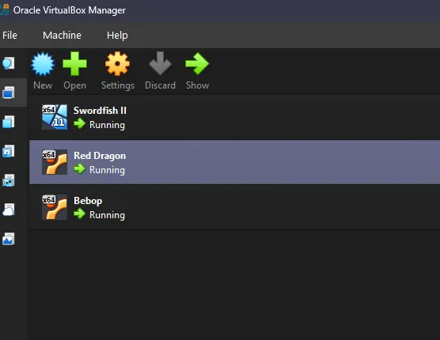
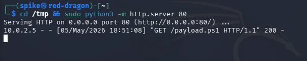
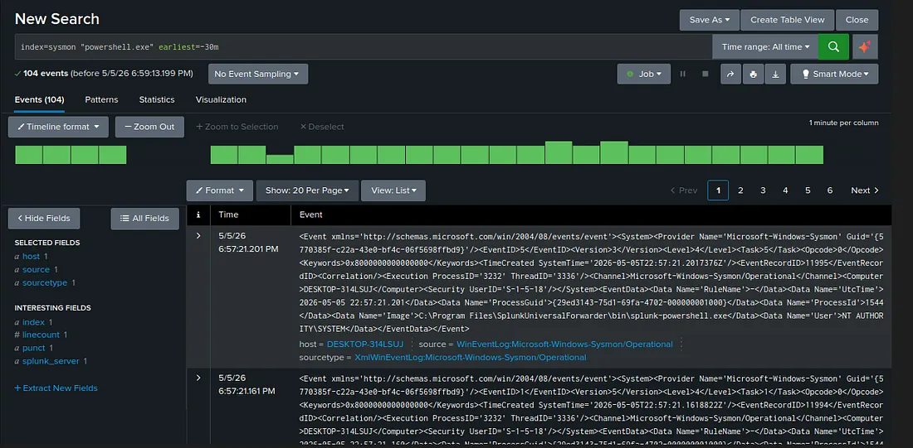
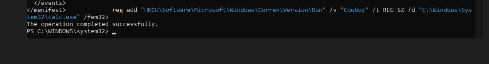
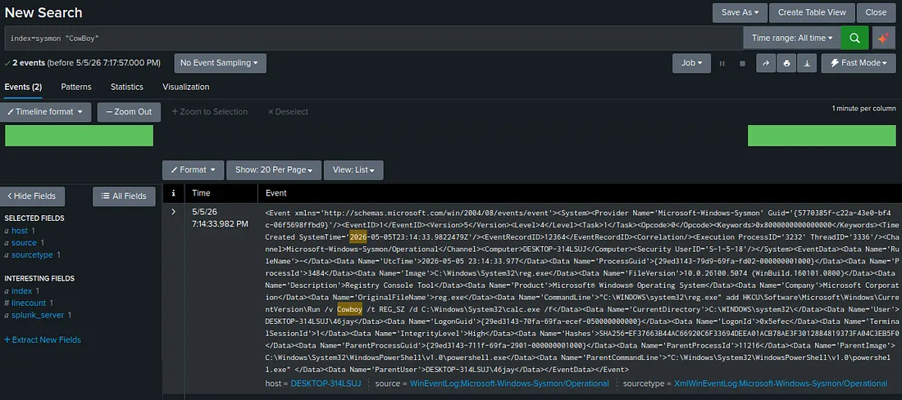
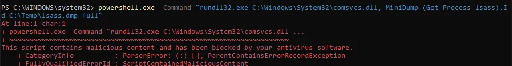
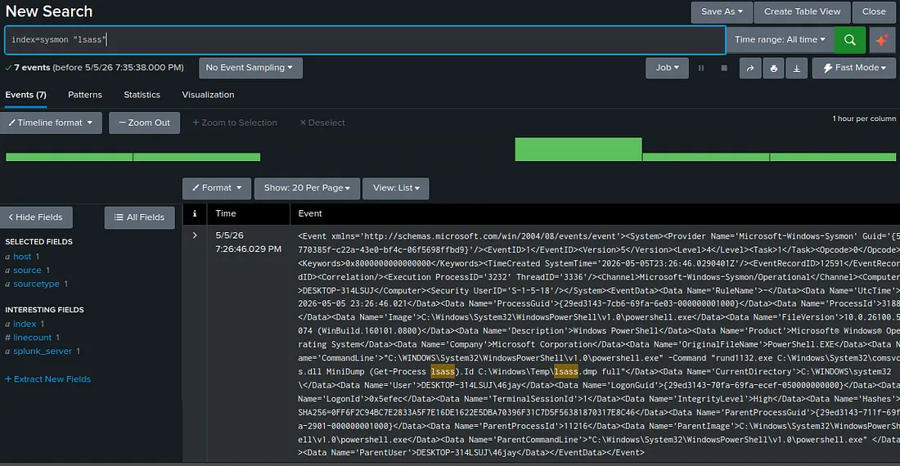
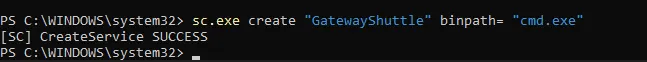
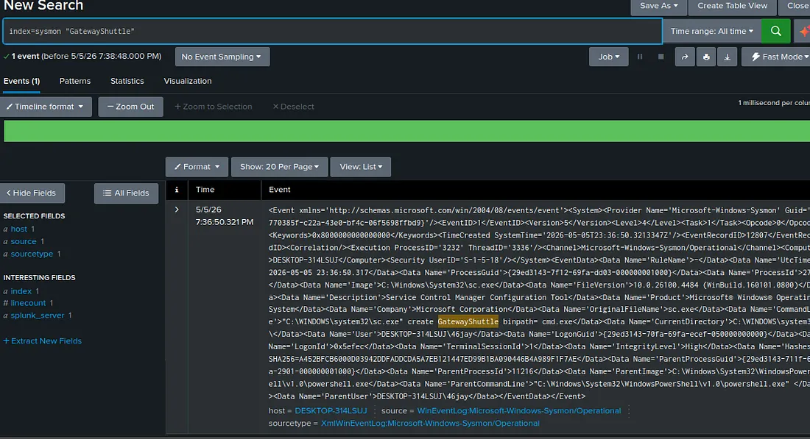

# Cowboy Bebop Threat Hunting Lab

A four-episode SIEM threat detection lab built with Splunk, Sysmon, and three VirtualBox VMs — each named after a ship from Cowboy Bebop.

---

## Lab Architecture

| VM | OS | IP | Role |
|---|---|---|---|
| Bebop | Ubuntu 24.04 | 10.0.2.6 | Splunk Enterprise 10.2.3 (SIEM) |
| Swordfish II | Windows 11 | 10.0.2.5 | Victim — Sysmon + Universal Forwarder |
| Red Dragon | Kali Linux | 10.0.2.3 | Attacker |

All three VMs running on a VirtualBox NatNetwork:



---

## Episodes

| Episode | Technique | MITRE ATT&CK | Sysmon Event |
|---|---|---|---|
| Tank! | PowerShell download cradle | T1059.001 | Event ID 1 |
| Stray Dog Strut | Registry run key persistence | T1547.001 | Event ID 13 |
| Honky Tonk Women | LSASS memory dump attempt | T1003.001 | Event ID 1 |
| Gateway Shuffle | Rogue Windows service creation | T1543.003 | Event ID 1 |

---

## Episode 1 — Tank! (PowerShell Download Cradle)

**Technique:** T1059.001 — Command and Scripting Interpreter: PowerShell  
**Sysmon Event:** ID 1 (Process Create)

Red Dragon served a PowerShell payload over HTTP on port 80, which Swordfish II retrieved using a download cradle:



Splunk detected 104 Sysmon events matching `powershell.exe`:

```spl
index=sysmon "powershell.exe" earliest=-30m
```



---

## Episode 2 — Stray Dog Strut (Registry Run Key Persistence)

**Technique:** T1547.001 — Boot or Logon Autostart Execution: Registry Run Keys  
**Sysmon Event:** ID 13 (Registry Value Set)

A registry run key named `Cowboy` was planted under `HKCU\Software\Microsoft\Windows\CurrentVersion\Run` pointing to `calc.exe` as a benign persistence payload:

```powershell
reg add "HKCU\Software\Microsoft\Windows\CurrentVersion\Run" /v "Cowboy" /t REG_SZ /d "C:\Windows\System32\calc.exe" /f
```



Splunk caught the registry write event — Sysmon Event ID 13 logged the full key path and value:

```spl
index=sysmon "Cowboy"
```



---

## Episode 3 — Honky Tonk Women (LSASS Memory Dump)

**Technique:** T1003.001 — OS Credential Dumping: LSASS Memory  
**Sysmon Event:** ID 1 (Process Create)

An LSASS dump was attempted using `rundll32.exe` and `comsvcs.dll` from PowerShell. Windows Defender blocked execution and flagged it as `ScriptContainedMaliciousContent`:



Splunk still captured 7 Sysmon events showing the process creation attempt:

```spl
index=sysmon "lsass"
```



---

## Episode 4 — Gateway Shuffle (Rogue Service Creation)

**Technique:** T1543.003 — Create or Modify System Process: Windows Service  
**Sysmon Event:** ID 1 (Process Create)

A rogue service named `GatewayShuttle` was created using `sc.exe`, binding `cmd.exe` as the service binary:



Splunk detected a single Sysmon event capturing the full `sc.exe` command line:

```spl
index=sysmon "GatewayShuttle"
```



---

## Tools Used

- Splunk Enterprise 10.2.3
- Sysmon (SwiftOnSecurity ruleset)
- Kali Linux
- VirtualBox NatNetwork

---

## Full Writeup

Published on Medium: [See You Space Cowboy: Bounty Hunting Threats with Splunk](https://medium.com/@jwilliams.cyber/see-you-space-cowboy-bounty-hunting-threats-with-splunk-911ffbed051a)
